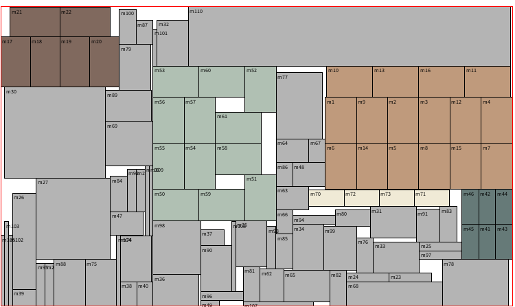

# CS6135 VLSI Physical Design Automation (2025), HW4

這是一個晶片佈置課程的作業四？作業要求請看 [pdf/CS6135_HW4_spec.pdf](./pdf/CS6135_HW4_spec.pdf)

     
    <h3>Public1 Case (8 sec, i5-13400F)</h3>
    

     
    <h3>Public2 Case (43 sec, i5-13400F)</h3>
    

     
    <h3>Public3 Case (134 sec, i5-13400F)</h3>
    

